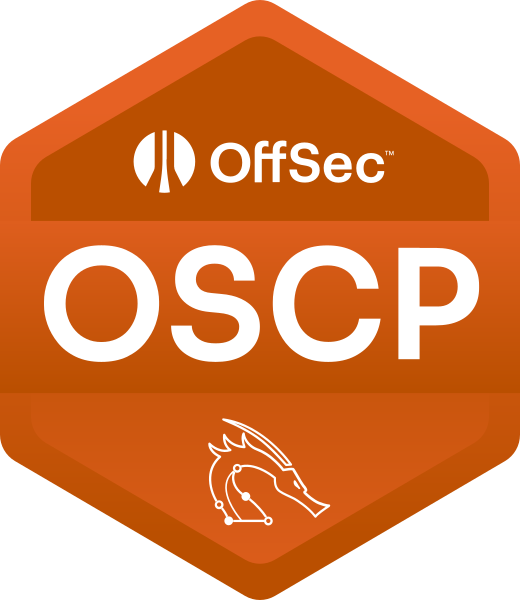
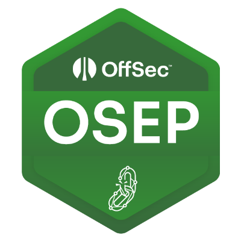
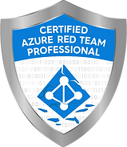
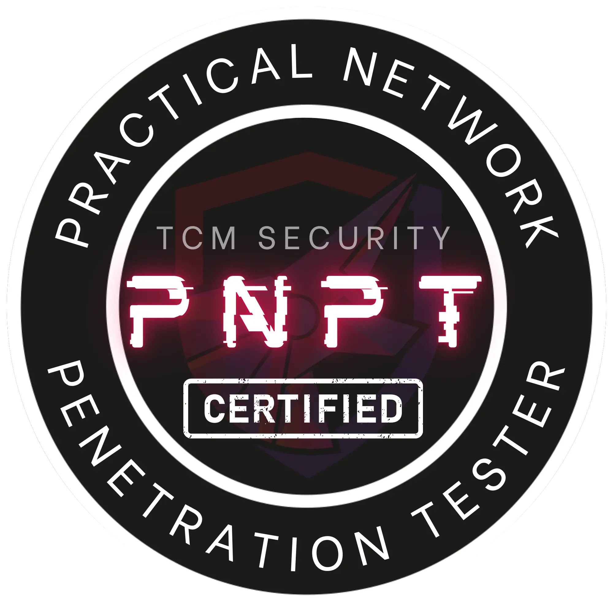
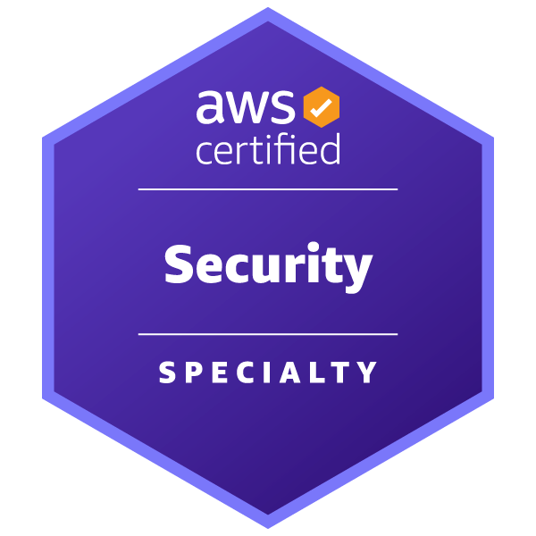
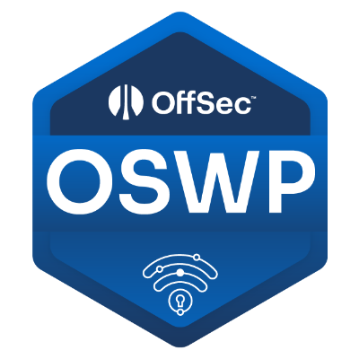
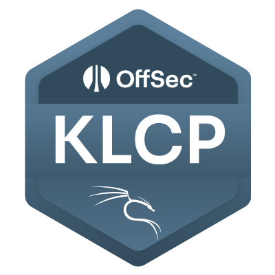
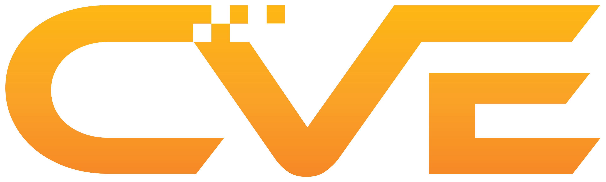

<h1 align="center">🛡️ Gikaku / ギカク</h1>
<h3 align="center">Offensive Security Researcher&nbsp;|&nbsp;Red Team&nbsp;|&nbsp;CVE Contributor</h3>

  <!-- domain updated to demolab.com (old herokuapp domain is deprecated) -->
  

  
  <!-- TODO: replace with your public LinkedIn vanity URL, or delete this line -->
  
  

---

## 🧭 About Me

- Offensive security focused on **penetration testing, adversary emulation & vulnerability research**
- **Red Team** @ **Sophos** · Secureworks CTU™ Adversary Group
- Day job: **APT emulation / adversary simulation**, **TLPT** (Threat-Led Penetration Testing), and full-scope **red team operations**
- Currently auditing the **MCP (Model Context Protocol) ecosystem** — SSRF, OAuth/DCR abuse, token confusion, and supply-chain attack surface across 20+ vendors
- Bilingual security blogger (English / 日本語) — write-ups, PoCs, and research notes
- Happy to talk **web / AD / cloud pentest, adversary emulation, and coordinated vuln disclosure**

---

## 🏅 Certifications

<!-- Ordered by weight: OffSec core first, then cloud/specialist, then foundational. -->

  
  
  
  
  
  
  
  

---

## 🛠️ Skill Matrix

| Red Team / Adversary Emulation | Vulnerability Research | Cloud / Infra |
|--------------------------------|------------------------|---------------|
| Adversary Emulation (APT) TLPT&nbsp;/&nbsp;Threat-Led PT Active Directory PT Web&nbsp;/&nbsp;Network PT OSINT | Vulnerability Research Source Code Review Coordinated Disclosure PoC Development | AWS Security Container&nbsp;/&nbsp;K8s MCP&nbsp;/&nbsp;API Security |

### Core Tooling

  
  
  
  
  
  
  
  

---

## 🐞 Vulnerability Research & Recognition

  

- 📌 **Published CVEs** across open-source and MCP-ecosystem projects
- 🏆 **Hall of Fame / Acknowledgements** — recognized by multiple major vendors (incl. Japanese enterprises) and listed in national CERT acknowledgements
- 🧵 Selected write-ups available on the [blog](https://skypoc.wordpress.com)

<!-- Optional, only if you want it concrete:
- CVE-2026-XXXXX (dbt-mcp) · GHSA-xxxx (Contentful MCP) · ...
- Hall of Fame: Rakuten · Mercari · BANDAI NAMCO · Neo4j · ...
-->

---

## 🚀 Current Focus

| Area | Topics |
|------|--------|
| **Research** | MCP / LLM-tooling security&nbsp;•&nbsp;Cloud Security&nbsp;•&nbsp;Attack-surface analysis |
| **Tooling** | Detection & exploitation PoCs&nbsp;•&nbsp;Security automation |
| **Sharing** | Conference talks (CFP in progress)&nbsp;•&nbsp;Bilingual technical blogging |
| **Goals** | Deep offensive-security craft&nbsp;•&nbsp;Community contribution |

---
