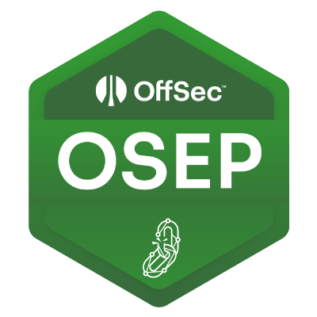
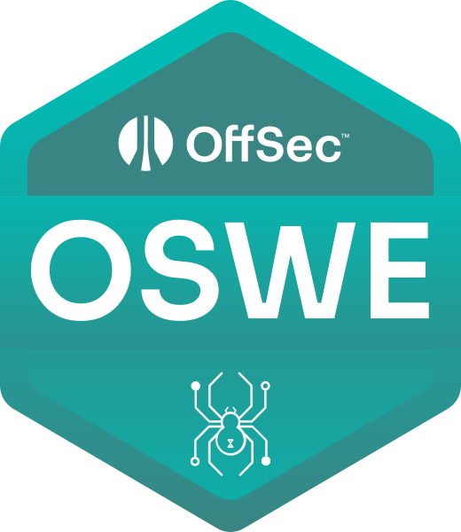
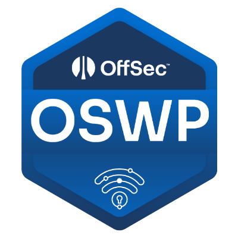
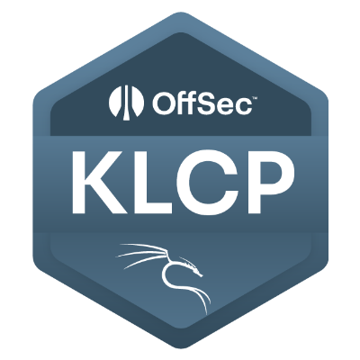
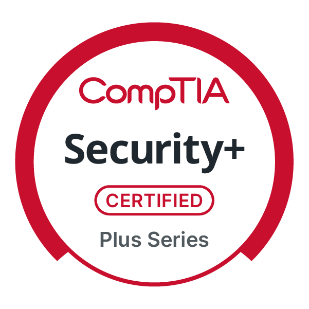

<h1 align="center">HE WEI（ギカク / Gikaku）</h1>

  <strong>Red Teaming · Cloud Security · Vulnerability Research</strong>

  
  
  
  

---

## About

I work in offensive security, mainly in red teaming and vulnerability research.

I am currently a Red Team Analyst at Sophos. My day-to-day work includes threat-led penetration testing (TLPT), adversary simulation, and full-scope red team engagements.

My red team work covers Active Directory, Azure and Entra ID, AWS and OCI, phishing and initial access, C2 infrastructure, privilege escalation, lateral movement, cloud attack paths, and EDR/XDR evasion. I am also doing independent research on GCP attack paths, IAM, credentials, and cloud identity.

I have been involved in offensive security since 2015, starting with vulnerability research and bug bounty work before moving into professional penetration testing and red team operations.

Outside of engagements, I spend much of my research time reviewing source code and testing security boundaries in operating systems, virtualization software, cloud tooling, identity systems, and MCP infrastructure.

My research has resulted in 50 assigned CVEs, upstream Linux kernel fixes, security credit from Apple, coordinated disclosures with major vendors, an MSRC Special Mention, and Google Honorable Mentions.

Technical write-ups and research notes are published at [gikaku.net](https://gikaku.net).

---

## Work

| Red Team | Cloud | Vulnerability Research |
|---|---|---|
| TLPT / Threat-Led PT | Azure / Entra ID | Source code review |
| Adversary simulation | AWS | Native code |
| Active Directory | OCI | Linux kernel |
| Initial access / phishing | GCP research | macOS |
| C2 infrastructure | IAM privilege escalation | Virtualization / libvirt |
| Privilege escalation | Credential and token abuse | Identity systems |
| Lateral movement | Cloud lateral movement | MCP / AI infrastructure |
| EDR/XDR evasion | Hybrid identity | PoC development |

---

## Vulnerability Research

### Selected Application, Cloud and MCP CVEs

| CVE | Vendor / Project | Score | CVSS Basis | Severity |
|---|---|---:|---|---|
| CVE-2026-53709 | IBM / ContextForge | 9.8 | v3.1 · GitHub Advisory | Critical |
| CVE-2026-14537 | Google / MCP Toolbox | 9.8 | v3.1 · NVD | Critical |
| CVE-2026-76092 | Docker MCP Gateway | 9.2 | v4.0 · GitHub / Docker | Critical |
| CVE-2026-11719 | Google / MCP Toolbox | 8.6 | v4.0 · Google CNA | High |
| CVE-2026-16328 | HashiCorp / Consul MCP Server | 8.6 | v3.1 · HashiCorp CNA | High |
| CVE-2026-16481 | Google / MCP Toolbox | 8.4 | v4.0 · Google CNA | High |
| CVE-2026-14541 | Google / MCP Toolbox | 8.0 | v4.0 · Google CNA | High |
| CVE-2026-14538 | Google / MCP Toolbox | 7.7 | v3.1 · NVD | High |
| CVE-2026-76094 | Docker MCP Gateway | 7.7 | v4.0 · GitHub / Docker | High |
| CVE-2026-53957 | Contentful MCP Server | 7.7 | v3.1 · GitHub Advisory | High |
| CVE-2026-14539 | Google / MCP Toolbox | 7.5 | v3.1 · NVD | High |
| CVE-2026-54358 | MISP Project | 7.5 | v4.0 · CIRCL CNA | High |
| CVE-2026-63128 | MCP Rust SDK | 7.5 | v3.1 · GitHub Advisory | High |
| CVE-2026-63658 | MCP Kotlin SDK | 7.5 | v3.1 · GitHub Advisory | High |
| CVE-2026-67432 | MCP Ruby SDK | 7.5 | v3.1 · GitHub CNA | High |
| CVE-2026-52869 | MCP Python SDK | 7.1 | v3.1 · GitHub Advisory | High |
| CVE-2026-63118 | MCP Ruby SDK | 6.9 | v4.0 · GitHub CNA | Medium |
| CVE-2026-76095 | Docker MCP Gateway | 6.8 | v4.0 · GitHub / Docker | Medium |
| CVE-2026-53708 | IBM / ContextForge | 6.6 | v3.1 · GitHub Advisory | Medium |
| CVE-2026-82968 | Red Hat / Keycloak | 6.4 | v3.1 · Red Hat CNA | Medium |
| CVE-2026-44968 | dbt Labs / dbt-mcp | 6.3 | v3.1 · GitHub CNA | Medium |
| CVE-2026-48529 | GitHub MCP Server | 6.0 | v3.1 · GitHub CNA | Medium |
| CVE-2026-67430 | MCP Ruby SDK | 5.3 | v3.1 · GitHub CNA | Medium |
| CVE-2026-54357 | MISP Project | 5.1 | v4.0 · CIRCL CNA | Medium |
| CVE-2026-6948 | Rapid7 / Velociraptor | 4.9 | v3.1 · Rapid7 CNA | Medium |
| CVE-2026-44970 | dbt Labs / dbt-mcp | 4.3 | v3.1 · NVD | Medium |
| CVE-2026-44969 | dbt Labs / dbt-mcp | 3.3 | v3.1 · NVD | Low |
| CVE-2026-76093 | Docker MCP Gateway | 2.3 | v4.0 · GitHub / Docker | Low |

### Systems, Kernel and Virtualization

| CVE | Vendor / Project | Component | Impact |
|---|---|---|---|
| CVE-2026-65374 | Apple | macOS WebDAV | Code execution |
| CVE-2026-43677 | Apple | macOS WebDAV | Heap out-of-bounds write |
| CVE-2026-68326 | Linux Kernel | `mwifiex` | Slab out-of-bounds read |
| CVE-2026-63622 | Red Hat / libvirt | `swtpm` state handling | Sandbox boundary privilege escalation |
| CVE-2026-68402 | Linux Kernel | `cfg80211` | Slab out-of-bounds read |
| CVE-2026-63623 | Red Hat / libvirt | Storage volume clone / convert | Guest disk information disclosure |
| CVE-2026-43806 | Apple | macOS `mDNSResponder` | Local denial of service |
| CVE-2026-64339 | Linux Kernel | `usbio` | Slab out-of-bounds read / kernel memory disclosure |

The tables above contain selected public CVEs. The total count includes additional published findings not listed here.

---

## Selected Research

### Apple

Reported multiple macOS vulnerabilities, including:

- CVE-2026-65374 · WebDAV memory corruption leading to code execution
- CVE-2026-43677 · WebDAV heap out-of-bounds write
- CVE-2026-43806 · `mDNSResponder` out-of-bounds read

### Linux Kernel

Reported three vulnerabilities across wireless and USB attack surfaces:

- CVE-2026-68326 · `mwifiex`
- CVE-2026-68402 · `cfg80211`
- CVE-2026-64339 · `usbio`

Fixes were integrated into upstream Linux development.

### libvirt

Reported:

- CVE-2026-63622 · `swtpm` filesystem and ownership boundary issue
- CVE-2026-63623 · Storage-volume permission window during clone and conversion operations

### Google MCP Toolbox

Reported six vulnerabilities covering authentication, authorization, OAuth handling, BigQuery access control, request handling, and credential exposure:

`CVE-2026-11719` · `CVE-2026-14537` · `CVE-2026-14538` · `CVE-2026-14539` · `CVE-2026-14541` · `CVE-2026-16481`

### Docker MCP Gateway

Reported four vulnerabilities:

`CVE-2026-76092` · `CVE-2026-76093` · `CVE-2026-76094` · `CVE-2026-76095`

The issues covered missing authentication, image signature verification, local file access, and SSRF.

### Keycloak

Reported CVE-2026-82968, a persistent wrong-account linking issue in the first-broker-login flow.

### MCP Ecosystem

Security research across Google, Docker, GitHub, IBM, HashiCorp, Contentful, dbt Labs, MISP, Rapid7, and official Model Context Protocol SDK projects.

The work has covered authentication, authorization, cross-user isolation, SSRF, local file access, credential exposure, tool permissions, request handling, and resource lifecycle issues.

---

## Recognition

| Program / Project | Recognition |
|---|---|
| Microsoft Security Response Center | HE WEI · 2027 Special Mention |
| Google | Honorable Mentions |
| Apple Security | CVE-2026-65374 · CVE-2026-43677 · CVE-2026-43806 |
| Google MCP Toolbox | CVE-2026-11719 · CVE-2026-14537 · CVE-2026-14538 · CVE-2026-14539 · CVE-2026-14541 · CVE-2026-16481 |
| Docker MCP Gateway | CVE-2026-76092 · CVE-2026-76093 · CVE-2026-76094 · CVE-2026-76095 |
| Red Hat / libvirt | CVE-2026-63622 · CVE-2026-63623 |
| Red Hat / Keycloak | CVE-2026-82968 |
| Linux Kernel | CVE-2026-68326 · CVE-2026-68402 · CVE-2026-64339 |
| MCP Kotlin SDK | CVE-2026-63658 |
| IPA | 7 vulnerability acknowledgements |

Other responsible disclosure acknowledgements include Rakuten, Mercari, BANDAI NAMCO, Sky, Neo4j, MISP Project, SBI Holdings, Seven Bank, Yahoo Japan, Keysight, Lumen, Clarivate, and others.

---

## Certifications

  
  
  
  
  
  
  
  
  

Currently working toward OSED and the OSCE3 certification path.

---

## Current Focus

| Area | Current Work |
|---|---|
| Red Team | TLPT · Active Directory · Initial access · C2 · EDR/XDR evasion |
| Cloud | GCP · Azure / Entra ID · AWS · OCI · IAM · Cloud attack paths |
| Systems | macOS · Linux kernel · libvirt · Native code |
| MCP / AI | MCP servers · SDKs · Authentication · Authorization · Credentials · Isolation |
| Research | Source code review · Dynamic analysis · Patch analysis · PoC development |
| Sharing | Vulnerability write-ups · Conference talks · Coordinated disclosure |

---

Technical write-ups and PoCs: [gikaku.net](https://gikaku.net)
